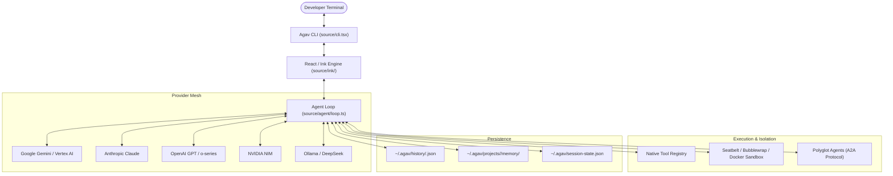
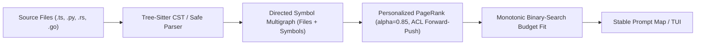
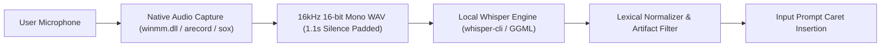
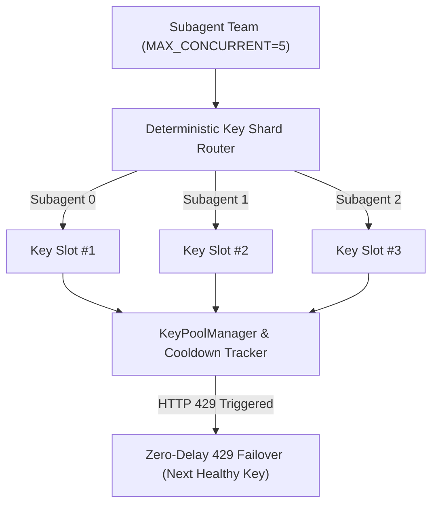

# Agav Platform Overview

> **"Stay in the Shell."** — Terminal-native AI coding assistant engineered for production software repositories.

Agav is an autonomous developer companion operating directly inside modern terminal emulators. Built on a customized, high-performance React/Ink rendering pipeline and compiled to single native binaries, Agav provides deep codebase indexing, multi-agent orchestration, sandboxed tool execution, and native support for major LLM providers.

---

## 1. System Topology & Core Capabilities



### Key Highlights
- **Pluggable Multi-Provider Core:** Seamless runtime switching between Google Gemini (`gemini-2.5-pro`, `gemini-2.5-flash`), Anthropic Claude (`claude-sonnet-4-5`), OpenAI (`gpt-5.4-mini`), NVIDIA NIM (`nemotron-3.5-lightning`), DeepSeek, and local Ollama instances.
- **Multi-Agent Orchestration (`AGENTS.md`):** Delegate complex, domain-specific tasks (e.g. Jira, GitHub, Slack) to specialized sub-agents with dedicated credential isolation.
- **Polyglot Agent Protocol (A2A):** Run specialized agent workers written in Python, Rust, or Go over lightweight HTTP loopback endpoints (`/health`, `/execute`, `/stream`).
- **Sandboxed Tool Execution:** Untrusted third-party agent tools run under strict OS-level isolation (Apple Seatbelt on macOS, Bubblewrap on Linux, or Docker containers).
- **Tree-Sitter CST Repository Map & PageRank:** Incrementally parses multi-language ASTs into a directed symbol dependency multigraph. Applies Personalized PageRank ($\alpha=0.85$) with Andersen-Chung-Lang forward-push local approximation and binary-search budget fitting to supply high-relevance code context while preserving prompt cache invariance.
- **Session Branching & Persistent Resumption:** Complete conversation history trees with `/branch` and interactive session resumption (`/resume`).

---

## 2. Command Reference

### Interactive Slash Commands
| Command | Arguments | Description |
| :--- | :--- | :--- |
| `/repomap` | `[--budget N] [--focus F] [--json]` | Interactive topological symbol map ranked by PageRank with real-time budget scaling |
| `/resume` | `[id/name]` | Opens the interactive fuzzy session picker or resumes by prefix |
| `/branch` | `[name]` | Forks the active conversation into a new branch without altering root history |
| `/model` | `[model-id]` | Interactively switches model and auto-selects appropriate provider |
| `/agents` | - | Launches the full TUI Service Agent Manager (List, Marketplace, Create) |
| `/agent-lock` | `[name]` | Locks the active session strictly to a specific service agent |
| `/clear` | - | Preserves the session to history and starts a fresh conversation turn |
| `/memory` | - | Inspects and refreshes repository-specific project memory |
| `/steer` | `<guidance>` | Injects directional guidance into an in-flight turn without interrupting |
| `/exit` | - | Saves state, flushes telemetry, stops agents, and exits gracefully |

### CLI Invocation Syntax
```powershell
# Interactive development
agav

# Explicit provider & model
agav --provider gemini --model gemini-2.5-pro
agav --provider nvidia --model nvidia/nemotron-3.5-lightning-30b-a3b

# Non-interactive / CI Pipe mode
agav run "audit dependencies and report vulnerabilities"
agav -P --stream "explain package.json"

# Service Agent Management
agav agents list
agav agents install https://github.com/your-org/agents/jira-agent
agav agents disable jira
```

---

## 3. Tree-Sitter CST Repository Map & Interactive TUI (`/repomap`)

Agav features an incremental repository indexing engine (`source/repomap/`) that extracts structural symbols and reference topologies across multi-language codebases without exhausting LLM context windows or invalidating provider KV prompt caches.



### Key Architectural Capabilities
- **Multi-Language Safe AST Extractors:** Tree-Sitter Concrete Syntax Tree (CST) extractors with native regex-based fallback for TypeScript/JavaScript, Python, Rust, and Go. Extracts exported functions, classes, interfaces, traits, structs, type aliases, and method signatures along with call and import reference edges.
- **Directed Symbol Multigraph:** Encodes file-level containment, import dependencies, symbol definitions, calls, extensions, and cross-file references into a dual-level graph.
- **Personalized PageRank ($\alpha=0.85$):**
  - **Global Ranking:** Power iteration across the file graph with uniform personalization vector $v_i = 1 / |F|$ and column-stochastic normalization, cascading file centrality to symbols based on in-degree and export status.
  - **Seed-Personalized Ranking:** Andersen-Chung-Lang (ACL) Forward-Push local approximation for seed-focused analysis (e.g. active editing buffers, user prompt mentions), concentrating probability mass around target subsystems in sub-millisecond time.
- **Monotonic Binary-Search Budget Fitting:** Optimally packs highest-scoring symbols into strict token constraints (default: 1,500 tokens) using monotonic bisection over score thresholds.
- **Two-Tier Cache Invariance:** Invariant deterministic node sorting and signature formatting maximize KV cache hits across Anthropic, Gemini, and OpenAI prompt caching architectures.

### Interactive `<RepoMapView>` TUI Component
Invoking `/repomap` launches an interactive terminal interface (`source/components/repo-map-view.tsx`):
- **Live Budget Scaling (`+` / `-`):** Dynamically expand or contract the token budget in 200-token increments with instant re-ranking and re-fitting.
- **Symbol & File Navigation (`↑` / `↓`):** Browse ranked files and inspect high-centrality symbols with color-coded type badges (`[func]`, `[class]`, `[struct]`, `[interface]`, `[type]`, `[var]`).
- **Tree Expansion (`Enter` / `Space`):** Drill down into individual file symbol signatures, line numbers, and PageRank weights.
- **Fuzzy Search (`/`):** Filter files and symbol signatures interactively in real time.
- **JSON Export Mode:** Run `/repomap --json` (or `/repomap --budget 2000 --focus source/app.tsx --json`) for automated tool consumption and CI validation.

---

## 4. Native Voice Input & Local Whisper STT Engine (`Ctrl+B`, `/mic`)

Agav provides a 100% native, local Speech-to-Text (STT) voice input pipeline designed for hands-free prompt composition directly in the terminal CLI without requiring cloud services or external audio driver installations.



### Key Voice Capabilities
- **Audio Capture Architecture:**
  - **Windows (Zero-Dependency):** Captures audio using Windows Multimedia API (`winmm.dll` `mciSendString`) via background PowerShell execution, recording 16kHz 16-bit mono PCM with zero external binary downloads or driver installations.
  - **Linux & macOS:** Integrates with standard system audio capture utilities (`arecord` from `alsa-utils` or `sox` on Linux; `sox` or `rec` on macOS) with automatic device selection.
- **Tuned Local Whisper Engine:**
  - **Acoustic Silence Padding:** Enforces `MIN_DECODE_SAMPLES = 17600` (1.1s), zero-padding short phrases to maintain high transcription fidelity on brief instructions.
  - **Dual Search Architecture:** Applies beam search (`-bs 2`) on short queries ($\le 8.0$s) for maximum technical precision and greedy decoding (`-bs 1 -bo 1`) on long speech to eliminate decode queue latency.
  - **Context Frame Truncation:** Clamps encoder frames via `-ac` to actual audio duration + 64 frames margin, reducing decode execution time by ~30%.
  - **Technical Developer Lexical Normalization:** Corrects accented misrecognitions to developer standards (`Redis`, `Kubernetes`, `Kafka`, `PostgreSQL`, `GraphQL`, `PyTorch`, `JWT`, `LRU`, `allkeys-lru`, `thundering herd`, `CI/CD`, `LeetCode`).
  - **Non-Speech & Prompt Echo Suppression:** Suppresses non-speech tokens (`-sns`), disables temperature fallback (`-nf`), filters audio annotations (`[BLANK_AUDIO]`, `(coughs)`, `*music*`, `♪`), and detects prompt regurgitation.
- **Interactive Terminal UI & Mouse Controls:**
  - `Ctrl+B` toggle hotkey to start and stop voice recording out-of-the-box on all terminals (with `Ctrl+M` supported on Kitty-protocol terminals).
  - Mouse click support: clicking the `[Ctrl+B 🎤 Mic]` badge or recording indicator toggles voice input directly.
  - Non-intrusive `[Ctrl+B 🎤 Mic]` badge on the input prompt line when idle (zero extra terminal row overhead).
  - Pulsating red recording indicator (`● [Recording... Press Ctrl+B or Enter to finish]`) and `⏳ [Transcribing speech locally...]` status banner.
  - Pressing `Enter` while recording automatically stops recording and injects text at the cursor position without submitting early.
  - Active text selections are smoothly replaced by transcribed speech upon completion.
  - `/mic` slash command for manual control, configuration, and hardware status diagnostics.

---

## 5. High-Throughput Multi-API-Key Pool & Adaptive Rate-Limit Sharding (`/keys`)

Agav incorporates an enterprise-grade multi-key pooling and subagent sharding engine designed to mitigate per-key LLM rate limits (`HTTP 429`) and provide bounded throughput scaling across concurrent subagent teams (subject to provider-level organization, IP, or account quotas).



### Multi-Key Features
- **Flexible Credential Configuration:** Accepts multi-key lists via comma-separated environment variables (`ANTHROPIC_API_KEY="key1,key2"`), numbered variables (`ANTHROPIC_API_KEY_1`, `ANTHROPIC_API_KEY_2`), or encrypted array entries in `~/.agav/config.json`.
- **Zero-Delay 429 Failover:** When an API key encounters an HTTP 429 rate limit or quota exhaustion, `KeyPoolProvider` immediately marks the key in cooldown (`coolingUntil = now + retryAfterMs`) and retries the streaming request on the next healthy key with 0ms sleep.
- **Parallel Subagent Key Sharding:** When multiple subagents run concurrently (`MAX_CONCURRENT = 5`), `executeSubagentsParallel` assigns distinct key indices across workers (Subagent $i$ executes on Key $i$), achieving up to $5\times$ parallel concurrency with distributed quota consumption when keys correspond to distinct quota allocations.
- **Security & Key Masking:** All API keys in logs and `/keys` reports are masked (e.g. `sk-ant...1234`), and encrypted at rest with AES-256-GCM.

---

## 6. Related Documentation

- [[architecture|Agav Architecture Specification]]: Deep dive into the Agent loop, Ink renderer, RepoMap Engine, Voice Engine, and Key Pool.
- [[phases|Phases & Roadmap]]: The 7 development, security hardening, code intelligence, and voice/multi-key phases.
- [[memory|Project Memory & Decisions]]: Persistent tracking of design choices, state, and bug resolutions.

