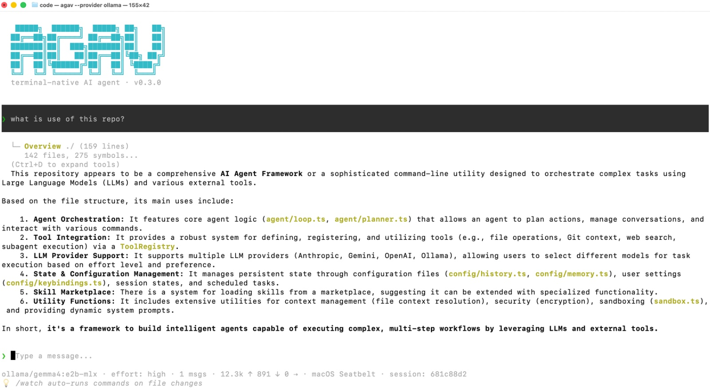

<div align="center">

<pre align="center" style="color: #0891B2;">
   █████╗  ██████╗  █████╗ ██╗   ██╗
  ██╔══██╗██╔════╝ ██╔══██╗██║   ██║
  ███████║██║  ███╗███████║██║   ██║
  ██╔══██║██║   ██║██╔══██║╚██╗ ██╔╝
  ██║  ██║╚██████╔╝██║  ██║ ╚████╔╝
  ╚═╝  ╚═╝ ╚═════╝ ╚═╝  ╚═╝  ╚═══╝
</pre>

**A terminal-native AI coding assistant for real repositories**

<p>
  
  
  
  
</p>

</div>

<div align="center">
  
</div>

## Installation

### Quick install (recommended)

One command, no Node.js required — Agav ships as a self-contained binary compiled with [Bun](https://bun.sh):

```bash
curl -fsSL https://agav.dev/install.sh | bash
```

For Windows PowerShell:

```powershell
irm https://agav.dev/install.ps1 | iex
```

For Windows Command Prompt (`cmd.exe`):

1. Download the installer:

   ```bat
   curl -fsSL https://agav.dev/install.cmd -o install.cmd
   ```

2. Run it from the same Command Prompt window:

   ```bat
   install.cmd
   ```

3. Remove `install.cmd` when you're done if you no longer need it:

   ```bat
   del install.cmd
   ```


Or download a specific platform binary from [Releases](../../releases).

### Run from source

#### macOS

```bash
git clone https://github.com/prapaa-ai/agav && cd agav && pnpm install --frozen-lockfile && pnpm build && pnpm start
```

#### Linux

```bash
git clone https://github.com/prapaa-ai/agav && cd agav && pnpm install --frozen-lockfile && pnpm build && pnpm start
```

#### Windows

```powershell
git clone https://github.com/prapaa-ai/agav; cd agav; pnpm install --frozen-lockfile; pnpm build; pnpm start
```

## Documentation

Detailed CLI documentation can be found [here](https://docs.agav.dev).

## Contact

Email: contact@agav.dev
