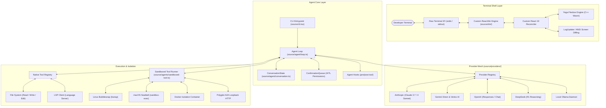
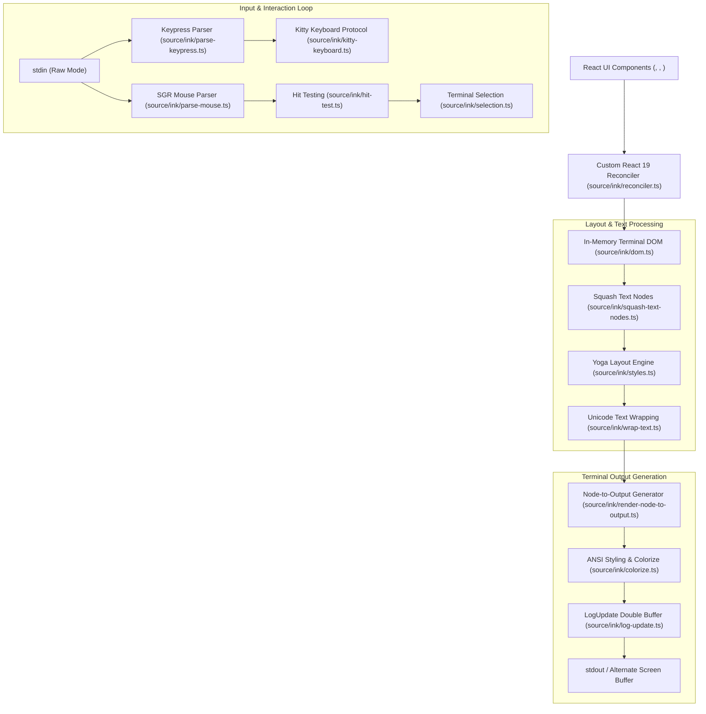
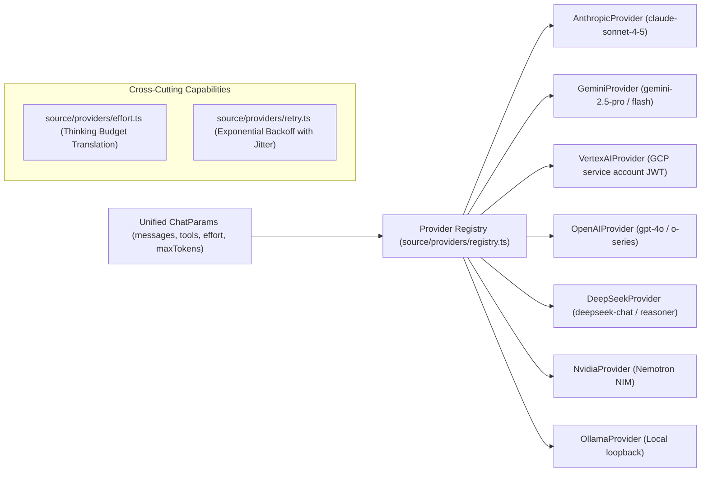
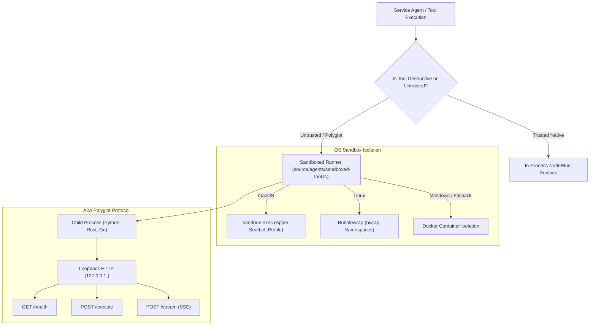

# Agav Architecture Specification

> **In-depth technical architecture of the Agent Loop, custom Ink terminal rendering engine, multi-provider mesh, and sandboxed execution layer.**

Agav is an autonomous developer companion designed for terminal environments. It is built as a single compiled binary without external runtime dependencies, combining a re-entrant streaming agent loop, a custom React 19 / Yoga layout terminal engine, an extensible provider abstraction, and operating-system-level tool sandboxing.

---

## Navigation & Related Documents

- [[Agav|Agav Platform Overview]]: Platform vision, CLI syntax, and quick reference.
- [[phases|Agav 5-Phase Development & Security Roadmap]]: Engineering milestones and security audit roadmap.
- [[memory|Project Memory & Decisions Log]]: Architectural Decision Records (ADRs) and project state.

---

## High-Level Topology



---

## 1. The Core Agent Loop (`source/agent/loop.ts`)

The Agent Loop is an asynchronous, event-driven generator function (`runAgentLoop`) that orchestrates the entire reasoning-action-observation cycle.

### Turn Lifecycle & Event Stream

Each conversation turn progresses through distinct, deterministic lifecycle stages:

```mermaid
sequenceDiagram
    participant User as Developer / TUI
    participant Loop as Agent Loop (runAgentLoop)
    participant State as ConversationState
    participant LLM as Provider Mesh
    participant HITL as ConfirmationQueue
    participant Tool as Tool Execution

    User->>Loop: User Prompt / Action
    Loop->>State: Append User Message
    Loop->>Loop: Compile Dynamic System Prompt (Git status, Memory, Agent Catalog)
    Loop->>LLM: Stream Chat Request (Messages, Tools, SystemPrompt, Effort)
    
    loop Streaming Turn
        LLM-->>Loop: StreamEvent (text / thinking / tool_call)
        Loop-->>User: Emit AgentEvent (streaming_text, thinking, tool_call_start)
    end

    alt Tool Call Requested
        Loop->>HITL: Sequential Permission Check (Phase 1)
        HITL-->>User: Interactive Prompt (Y / N / Always) [if destructive]
        User-->>HITL: Approved
        HITL-->>Loop: Confirmation Granted
        
        Loop->>Tool: Execute Tool (Phase 2: parallel or sandboxed)
        Tool-->>Loop: ToolResult (output, diffLines, isError)
        Loop->>State: Append Tool Result ContentBlock
        Loop-->>User: Emit AgentEvent (tool_result)
        Loop->>LLM: Recursively resume turn with tool results
    else No More Tools
        Loop->>State: Finalize Assistant Message
        Loop-->>User: Emit AgentEvent (turn_complete)
    end
```

### Agent Events (`AgentEvent`)
The loop communicates with the TUI entirely via strongly typed events:
```typescript
export type AgentEvent =
  | { type: "planning"; plan: string }
  | { type: "thinking"; text: string }
  | { type: "streaming_text"; text: string }
  | { type: "compacted"; droppedCount: number }
  | { type: "tool_call_start"; toolName: string; toolCallId: string }
  | { type: "tool_call_input_delta"; toolCallId: string; argsJson: string }
  | { type: "tool_confirmation_request"; toolName: string; toolCallId: string; input: Record<string, unknown>; diffLines?: DiffLine[] }
  | { type: "tool_result"; toolName: string; toolCallId?: string; output: string; isError: boolean; diffLines?: DiffLine[] }
  | { type: "assistant_message_complete"; text: string }
  | { type: "turn_complete" }
  | { type: "steer_applied"; directives: string[] }
  | { type: "usage"; inputTokens: number; outputTokens: number; cacheReadTokens?: number }
  | { type: "error"; error: Error };
```

### Two-Phase Tool Resolution & Safety
To maximize user safety without sacrificing parallelism:
1. **Phase 1: Sequential Human-in-the-Loop Permission Resolution**:
   - Every tool call generated by the model is evaluated against the `SAFE_TOOLS` set (`read_file`, `grep_search`, `find_files`, `list_directory`, `web_search`, `lsp_query`, `overview`, `save_memory`, `update_plan`).
   - Destructive tools (`write_file`, `edit_file`, `run_command`) trigger an interactive confirmation request displaying full input parameters and computed color-coded file diffs (`computeDiff` / `computeEditDiff`).
   - If denied by user, execution halts immediately with an explicit tool error sent back to the model.
2. **Phase 2: Execution**:
   - Approved tools execute. File modifications automatically register with the Undo stack (`pushUndo`).
   - If any `run_command` touches destructive patterns (`rm -rf`, `format`, `dd`), it is forced through the sandbox or confirmation.

### Mid-Turn Steering (`/steer`)
Agav allows users to inject steering directives while a turn is active. The `drainSteers` closure retrieves queued directives mid-turn, appending them to the conversation context without aborting the model's in-flight reasoning stream.

---

## 2. The Custom Ink Terminal Rendering Pipeline (`source/ink/`)

Unlike traditional CLI tools that use plain `console.log` or standard `ink`, Agav embeds a custom-engineered terminal rendering engine designed for real-time AI generation.



### Key Innovations in Agav's Ink Engine
1. **Zero-Flicker Screen Diffing (`log-update.ts`):**
   - Retains a virtual character matrix of the previous frame.
   - Computes surgical ANSI cursor movement commands to overwrite only mutated terminal cells, preventing the full-terminal redraw flicker typical of long AI outputs.
2. **Yoga Flexbox in Terminal:**
   - Full CSS Flexbox support in the terminal: `flexDirection`, `alignItems`, `justifyContent`, `padding`, `margin`, and `borderStyle`.
3. **Kitty Keyboard Protocol:**
   - Detects terminal support for extended keyboard reporting. Disambiguates `Ctrl+Enter`, `Shift+Tab`, and macOS `Cmd`/`Super` keys for modern developer UX.
4. **Native Mouse Selection & Clickable Paths:**
   - Direct SGR mouse tracking: handles mouse drag-selection, text copying, and clickable file paths/URLs (`source/utils/render-clickable.ts`).

---

## 3. The Multi-Provider Mesh (`source/providers/`)

Agav abstracts all LLM communications behind a unified `LLMProvider` contract:

```typescript
export interface LLMProvider {
  chat(params: ChatParams): Promise<ChatResponse>;
  stream(params: ChatParams): AsyncIterable<StreamEvent>;
}
```



### Provider Implementation Details
- **Anthropic (`anthropic.ts`):**
  - Native streaming using `@anthropic-ai/sdk`.
  - Translates `EffortLevel` into `thinking: { type: "enabled", budget_tokens: N }`.
- **Google Gemini Direct & Vertex AI (`gemini.ts`, `vertex-ai.ts`):**
  - Vertex AI features full RFC 7519 JWT assertion generation with clock-skew backdating (`SKEW_SECONDS`).
  - Google Search grounding integration.
- **OpenAI & DeepSeek (`openai.ts`, `deepseek.ts`):**
  - Supports both the OpenAI Responses API and Chat Completions.
  - DeepSeek provider dynamically intercepts reasoning deltas for live thinking visualization.
- **Ollama (`ollama.ts`):**
  - Connects to local daemon (`localhost:11434`), forwarding caller cancellation signals directly to prevent hung background inference.

---

## 4. Isolation, Sandboxing & Polyglot Multi-Agent Protocol

Agav guarantees secure execution of untrusted tools and polyglot subagents through OS-level containment.



### Sandbox Security Boundaries
- **Filesystem Restrictions:** Write access is restricted exclusively to the workspace directory (`process.cwd()`) and temporary scratch space. Sensitive directories (`~/.agav`, `~/.ssh`, `~/.aws`, `/etc`) are unconditionally mounted read-deny or shadowed with ephemeral tmpfs.
- **Credential Isolation:** Service agents declare credentials in `required-config`. Secrets are encrypted at rest using AES-256-GCM and injected into `process.env` **only** during the sub-agent tool invocation, ensuring the primary terminal session never exposes sensitive tokens.

---

> [!IMPORTANT]
> This specification is maintained as an active architectural reference in the repository root. Cross-reference with [[Agav|Agav.md]], [[phases|phases.md]], and [[memory|memory.md]].
