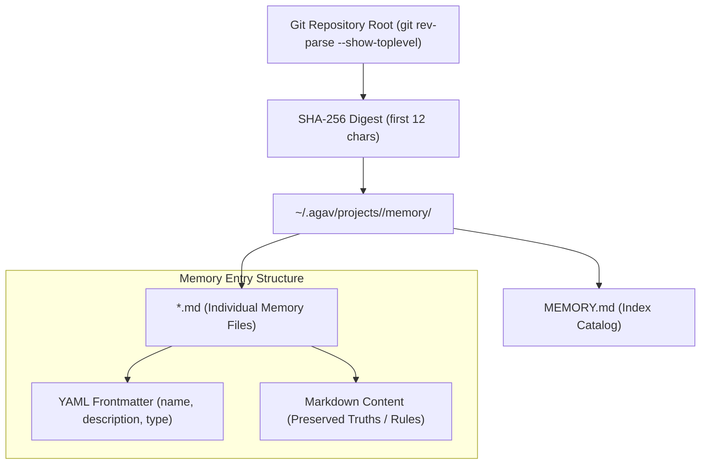
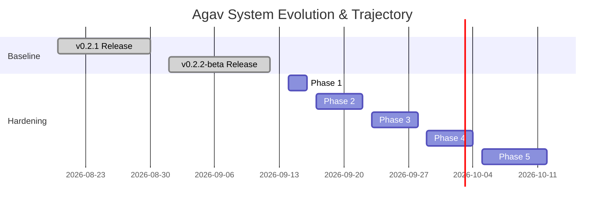

# Agav Project Memory & Decisions Log

> **Persistent architectural decisions, project trajectory, session state, and historical bug resolution catalog.**

This document provides durable project memory for **Agav**, tracking foundational architectural decisions (ADRs), execution trajectory, state persistence, and verified bug resolutions across development cycles.

---

## Navigation & Related Documents

- [[Agav|Agav Platform Overview]]: High-level architecture, CLI commands, and usage.
- [[phases|Agav 5-Phase Development & Security Roadmap]]: Five development and security hardening phases.
- [[architecture|Agav Architecture Specification]]: Deep technical dive into the Agent Loop, custom Ink engine, and provider mesh.

---

## 1. Agav Memory System Architecture

Agav incorporates a native persistent memory subsystem (`source/config/memory.ts`) scoped directly to the repository root. Unlike temporary in-session conversation history, durable project memories persist across sessions and restarts.



### Memory Types & Schema
Each memory file (`<slug>.md`) in the repository memory store adheres to standard YAML frontmatter:
```yaml
---
name: state-json-contract
description: Run counter format specification
type: project   # "user" | "feedback" | "project" | "reference"
---

counter.py reads and writes state.json with a {"count": N} shape. Any module that touches the counter must preserve this format.
```

### Interactive Memory Commands
| Command | Action |
| :--- | :--- |
| `/remember <text>` | Saves durable project memory into `~/.agav/projects/<hash>/memory/` |
| `/memory list` | Lists all saved memories for current Git repository |
| `/memory path` | Prints absolute storage path for inspection |
| `/memory delete <name>` | Deletes specific memory entry by name |
| `/forget <name>` | Removes obsolete or superseded memory |
| `/memory clear` | Purges all memories for current project |

---

## 2. Architectural Decision Records (ADRs)

### ADR-001: Custom React/Ink Terminal Engine
- **Status:** Accepted
- **Context:** Standard `ink` and `blessed` packages suffer from significant terminal rendering lag, high memory consumption under rapid token streaming, lack of raw mouse drag selection, and frequent flicker on ANSI-rich diff outputs.
- **Decision:** Vendor and maintain a specialized terminal rendering pipeline (`source/ink/`):
  - Integrate Facebook's `yoga-layout` for native flexbox calculation.
  - Implement a custom React 19 reconciler (`source/ink/reconciler.ts`) with custom DOM primitives (`ink-box`, `ink-text`).
  - Native Kitty Keyboard Protocol support (`source/ink/kitty-keyboard.ts`) for disambiguated modifier keys and super-keys.
  - Differential terminal screen updates (`source/ink/log-update.ts`) with cursor-save optimizations.

### ADR-002: Three-Tier Service Agent Priority & Credential Scoping
- **Status:** Accepted
- **Context:** Developers need domain-specialized agents (Jira, GitHub, Slack) that can be installed globally, committed per-project, or bundled with Agav, without cross-contaminating host credentials.
- **Decision:** Establish a 3-tier loading priority:
  $$\text{Bundled} \prec \text{Global } (\sim/.agav/agents/) \prec \text{Project } (.agav/agents/)$$
  - Later tiers strictly override earlier tiers by agent `name`.
  - Credentials declared in `required-config` are stored in per-agent encrypted `config.json` files and injected into `process.env` **only** for the duration of individual tool calls.

### ADR-003: Unified Provider Abstraction & Reasoning Effort Translation
- **Status:** Accepted
- **Context:** Different AI model providers expose distinct parameters for reasoning/thinking: Anthropic uses `thinking.budget_tokens`, OpenAI uses `reasoning_effort` (`low`, `medium`, `high`), and Gemini uses `thinkingConfig`.
- **Decision:** Define a single high-level `EffortLevel` enum (`low`, `medium`, `high`, `max`) in `source/providers/effort.ts`. The agent loop accepts `--effort` uniformly and maps it into provider-specific payloads at runtime.

### ADR-004: Windows Path & Filesystem Resilience
- **Status:** Accepted
- **Context:** Windows paths use backslashes (`\`), drive letters (`C:`), and CRLF line breaks. Additionally, Bun on Windows exhibits edge-case errors where `mkdir(..., { recursive: true })` throws `EEXIST` when writing files in the current working directory.
- **Decision:**
  - Normalize all file tools (`read_file`, `write_file`, `edit_file`) using `node:path.resolve()`.
  - Safely catch and ignore `EEXIST` errors on recursive `mkdir` calls in `source/tools/file-write.ts`.
  - Strip CRLF (`\r\n`) in string matching utilities (`computeEditDiff`).

### ADR-005: Sandboxed Tool Execution with Native OS Primitives
- **Status:** Accepted
- **Context:** Third-party marketplace agents and shell tools must run without endangering the user's host filesystem or exfiltrating tokens.
- **Decision:** Execute untrusted tools through OS-native sandbox wrappers:
  - **macOS:** Apple Seatbelt via `/usr/bin/sandbox-exec` with dynamic Scheme-like profiles.
  - **Linux:** Bubblewrap (`bwrap`) creating unprivileged mount, IPC, and network namespaces.
  - **Fallback / Containers:** Docker container runner for environments without native sandboxing.
  - **Deny-List Policy:** Explicitly deny access to `~/.agav`, `~/.ssh`, `~/.aws`, and host environment variables.

### ADR-006: Session History Trees & Persistent Resumption
- **Status:** Accepted
- **Context:** Developers frequently need to fork exploration paths, rollback failed experiments, or resume sessions across terminal restarts.
- **Decision:** Persist full conversation history trees in `~/.agav/history/<session-id>.json`. Support interactive fuzzy resumption (`/resume`) and zero-loss branching (`/branch`).

---

## 3. Session Trajectory & Active Milestones



### Current Status
- **Current Version:** `0.2.3-beta`
- **Phases Status:** **All 5 Phases COMPLETED**
  - Phase 1: Critical Security & Platform Hardening (Auto-update digest origin, sandbox credential protection, encrypted headers, safe installer, Windows `EEXIST`).
  - Phase 2: Terminal UI & Unicode Stability (Callable color guards, grapheme segmenter backspacing & middle truncation, per-row multiline caret prefix, unambiguous clickable target bounding, markdown indentation preservation).
  - Phase 3: Providers & Cancellation Resiliency (Ollama pre-flight abort, Vertex AI 1-hour assertion window with clock skew, OpenRouter model ID normalization, DeepSeek model provider routing).
  - Phase 4: Agent Lifecycle & Concurrency (Atomic staging before uninstall in marketplace & creator, input prompt error recovery in use-agent submitPendingRef, locked-agent attachment forwarding & compacting, detached browser spawning, safe signal cleanup in open-external, PowerShell CRLF normalization).
  - Phase 5: Verification, Benchmarks & Release (All 110 Vitest test suites passing with 940 tests, 0 TypeScript compile errors, full regression and enterprise security verification).

---

## 4. Historical Bug Catalog & Resolution Matrix

| Bug ID | Component | Symptom / Root Cause | Resolution | Status |
| :--- | :--- | :--- | :--- | :--- |
| **BUG-001** | `source/tools/file-write.ts` | Windows Bun `mkdir` throws `EEXIST` when directory exists or is `.`. | Caught `(err as NodeJS.ErrnoException)?.code !== "EEXIST"`. | **RESOLVED** |
| **BUG-002** | `source/providers/vertex-ai.ts` | Clock skew causes Google OAuth token rejection (`invalid_grant`). | Symmetrically backdated `iat` and `exp` by `SKEW_SECONDS`. | **RESOLVED** |
| **BUG-003** | `source/ink/colorize.ts` | Passing style objects to Chalk triggers non-callable errors (`level`, `bold`). | Added callable check: `typeof chalk[method] === "function"`. | **RESOLVED** |
| **BUG-004** | `source/utils/session-picker.ts` | Backspacing splits multi-byte emoji into replacement chars `\uFFFD`. | Migrated to `Intl.Segmenter` grapheme boundary deletion. | **RESOLVED** |
| **BUG-005** | `source/providers/ollama.ts` | Caller abort signal not forwarded to Ollama SDK prior to fetch. | Attached `signal` to `client.chat()` with pre-flight check. | **RESOLVED** |
| **BUG-006** | `source/agents/sandboxed-tool.ts` | Sandboxed tools able to read `~/.agav` config and API keys. | Injected `getAgavDir()` into sandbox read-deny lists. | **RESOLVED** |
| **BUG-007** | `source/utils/auto-update.ts` | SHA-256 digest fetched from mirror CDN instead of trusted release origin. | Enforced GitHub Release origin fetch for `.sha256` digest. | **RESOLVED** |
| **BUG-008** | `source/hooks/use-agent.ts` | Corrupt agent definition leaves submitPendingRef locked permanently. | Added try/catch resetting submitPendingRef and reporting error. | **RESOLVED** |
| **BUG-009** | `source/app.tsx` | Locked agent submissions dropped image and multi-part attachment blocks. | Preserved and forwarded attachment content blocks to submitToAgent. | **RESOLVED** |
| **BUG-010** | `source/utils/open-target.ts` | Opening browser via $BROWSER blocks event loop waiting for browser exit. | Detached spawn with `unref()` and setImmediate resolution. | **RESOLVED** |
| **BUG-011** | `source/utils/open-external.ts` | SIGINT handler called `process.exit(130)` pre-empting terminal restore. | Restricted signal handler to unspooling temp images without exiting. | **RESOLVED** |
| **BUG-012** | `source/commands/model.ts` | OpenRouter model ID with matching prefix fails to switch provider. | Added `isOpenRouter` to provider-switch condition. | **RESOLVED** |
| **BUG-013** | `source/agents/installer.ts` | Unvalidated HTTP redirects allowed in agent file downloads. | Enforced HTTPS-only and manual redirect loop with host validation. | **RESOLVED** |
| **BUG-014** | `source/components/agents-marketplace.tsx` | Corrupt agent update uninstalls working version before validation. | Added `loadAgent` pre-validation before removing active agent. | **RESOLVED** |
| **BUG-015** | `source/agents/sandboxed-tool.ts` | Single-file read allow prevents sibling tool modules and assets from loading. | Exposed sanitized `TOOL_DIR` package tree while denying `config.json`. | **RESOLVED** |
| **BUG-016** | `source/agents/sandboxed-tool.ts` | Process timeout/error masked if delimiter payload parsed with isError false. | Preserved error state via `Boolean(parsed.isError) || Boolean(error)`. | **RESOLVED** |
| **BUG-017** | `source/agents/sandboxed-tool.ts` | Bare delimiter token search truncated output when output contained token. | Matched newline-framed protocol delimiter `\n__AGAV_RESULT__\n`. | **RESOLVED** |
| **BUG-018** | `source/agents/sandboxed-tool.ts` | Symlinked private directories (`.ssh`, `~/.agav`) bypassed Bubblewrap tmpfs. | Resolved canonical paths via `realpathSync` and masked with tmpfs. | **RESOLVED** |
| **BUG-019** | `source/agents/targeting.ts` | Multimodal attachments dropped when targeting A2A agents. | Extended `A2ARequest` and client to serialize and forward `extraBlocks`. | **RESOLVED** |
| **BUG-020** | `source/tools/find-files.ts` | Exact 200 matches triggered false truncation warning. | Added explicit `truncated` flag based on early walkDir exit. | **RESOLVED** |

---

> [!NOTE]
> This document is maintained directly in repository root as an Obsidian knowledge node. Cross-reference with [[phases|phases.md]] and [[architecture|architecture.md]].
