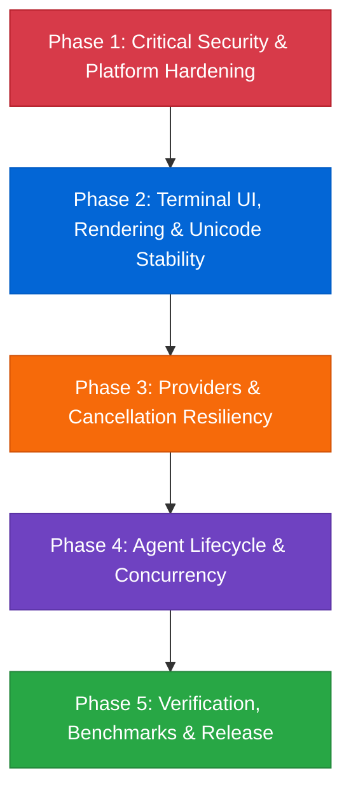
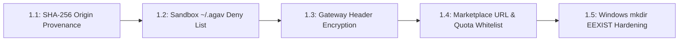

# Agav 5-Phase Development & Security Roadmap

> **Comprehensive platform hardening, security isolation, terminal UI stability, and multi-provider resilience.**

This document tracks the structured 5-phase engineering and security roadmap for **Agav**, derived from codebase security reviews, multi-platform runtime diagnostics, and the comprehensive CodeRabbit audit.

---

## Navigation & Related Documents

- [[Agav|Agav Platform Overview]]: Platform vision, CLI syntax, and core features.
- [[architecture|Agav Architecture Specification]]: Deep dive into the Agent Loop, custom Ink engine, and provider mesh.
- [[memory|Project Memory & Decisions Log]]: Architectural decisions, active trajectory, and bug resolution catalog.

---

## Roadmap Overview

---

## Phase 1: Critical Security & Platform Hardening

**Goal:** Eliminate remote execution vectors, credential exfiltration paths, and cross-platform filesystem crashes.

### Tasks & Technical Specifications

#### Task 1.1: Auto-Update SHA-256 Checksum Provenance
- **Component:** `source/utils/auto-update.ts`
- **Issue:** Auto-update downloads binary assets from CDN mirrors (e.g. Cloudflare R2). If checksum manifests are also fetched from untrusted or compromised mirrors, an attacker could tamper with release binaries undetected.
- **Resolution:** Force SHA-256 signature verification to always retrieve `.sha256` digests directly from the official GitHub Release origin (`api.github.com/repos/prapaa-ai/agav/releases`), regardless of where the binary artifact payload is mirrored. Verify digest against the downloaded binary buffer before replacing `process.execPath`.

#### Task 1.2: Host Sandbox Credential Isolation
- **Component:** `source/agents/sandboxed-tool.ts`
- **Issue:** Untrusted marketplace or third-party service agents running inside OS sandboxes (Bubblewrap / Seatbelt) could access `~/.agav/` to read global API keys (`~/.agav/config.json`), agent credentials (`~/.agav/agents/*/config.json`), or session history.
- **Resolution:** Explicitly inject `getAgavDir()` (`~/.agav`) into the read-deny profile.
  - **Linux (`bwrap`):** Append `--tmpfs ~/.agav` or omit mount binds for the configuration directory.
  - **macOS (`sandbox-exec`):** Append `(deny file-read* (subpath "${getAgavDir()}"))` to the generated Seatbelt scheme.
  - **Docker:** Exclude `~/.agav` from mounted volumes.

#### Task 1.3: Gateway Credential Encryption
- **Component:** `source/config/config.ts`
- **Issue:** Custom gateway headers (`openaiHeaders`) used for enterprise proxies and custom routing contain bearer tokens and API secrets stored as plaintext JSON in user configuration files.
- **Resolution:** Encrypt `openaiHeaders` values at rest using Agav's AES-256-GCM encryption utility (`source/utils/encrypt.ts`). Transparently decrypt when instantiating the OpenAI / OpenRouter client.

#### Task 1.4: Agent Marketplace Fetch Hardening
- **Component:** `source/agents/installer.ts`
- **Issue:** Installing agents from unverified arbitrary URLs can trigger SSRF, local network traversal, or zip-bomb disk exhaustion.
- **Resolution:** Validate `baseUrl` against an allowed domain whitelist (`github.com`, `raw.githubusercontent.com`, `gitlab.com`). Enforce an upper bound HTTP response limit (e.g. 5 MB) on manifest and tool downloads.

#### Task 1.5: Windows Filesystem Hardening & Documentation Completion
- **Component:** `source/tools/file-write.ts`, `Agav.md`, `phases.md`, `memory.md`, `architecture.md`
- **Issue:** On Windows when using Bun or specific Node versions, calling `mkdir(dirname(filePath), { recursive: true })` throws an unhandled `EEXIST` error if the directory already exists or is current working directory (`.`).
- **Resolution:**
  - Wrap `mkdir` in `file-write.ts` with explicit `EEXIST` error handling (`(err as NodeJS.ErrnoException)?.code !== "EEXIST"`).
  - Complete the full Obsidian knowledge graph (`Agav.md`, `phases.md`, `memory.md`, `architecture.md`) with cross-references, architecture diagrams, and persistent decision logging.

---

## Phase 2: Terminal UI, Rendering & Unicode Stability

**Goal:** Deliver glitch-free rendering, accurate mouse selection, and robust Unicode handling across diverse terminal emulators.

### Tasks & Technical Specifications

#### Task 2.1: Chalk Colorizer Property Safety
- **Component:** `source/ink/colorize.ts`
- **Issue:** Passing non-color properties or unexpected style names to Chalk could invoke non-callable object properties (e.g. `level`, `bold`, `visible`), resulting in `TypeError: chalk[color] is not a function`.
- **Resolution:** Resolve foreground and background color keys dynamically, confirming that `typeof chalk[method] === "function"` before invocation. Fall back gracefully to unstyled text on unresolvable keys.

#### Task 2.2: Surrogate Pair & Grapheme Cluster Backspacing
- **Component:** `source/utils/session-picker.ts`
- **Issue:** Backspacing in search filters or session rename inputs sliced strings by UTF-16 code units (`slice(0, -1)`), splitting multi-byte emoji, composite graphemes, or ZWJ sequences into invalid replacement characters (`\uFFFD`).
- **Resolution:** Segment text using `Intl.Segmenter(undefined, { granularity: "grapheme" })` and drop the final segmented grapheme cluster.

#### Task 2.3: Multiline Input Caret & Prefix Alignment
- **Component:** `source/components/input-prompt.tsx`
- **Issue:** Multi-line user input prompts use a lock prefix (`❯ ` or `🔒 `) on line 1, but two-space indentation on subsequent rows. Using a uniform `prefixWidth` for click-to-offset calculation caused the caret to jump horizontally on continuation lines.
- **Resolution:** Pass target row metadata into `eventToOffset` to subtract the exact rendered prefix width (`isFirst ? prefixWidth : DEFAULT_PREFIX_WIDTH`). Synchronize wrap-table calculations to match.

#### Task 2.4: Render Clickable Occurrence Mapping
- **Component:** `source/utils/render-clickable.ts`
- **Issue:** When multiple overlapping file paths or URLs appeared in output (e.g. `/app` and `/app/build/index.js`), greedy substring matching misassigned click targets to the shorter prefix.
- **Resolution:** Map occurrences sequentially in source order with exclusive bounding ranges, ensuring longer specific targets receive priority.

#### Task 2.5: Markdown Nested List Indentation Preservation
- **Component:** `source/components/markdown-text.tsx`
- **Issue:** Hard-split source lines stripped leading whitespace during line wrapping, flattening nested bulleted lists and code block indentation.
- **Resolution:** Distinguish source-line starts from auto-wrapped continuation rows in `wrapStyled`, preserving leading spaces on original source lines.

#### Task 2.6: Text Mouse Event Forwarding
- **Component:** `source/ink/components/Text.tsx`
- **Issue:** `onMouseMove` events were omitted during props destructuring in `Text.tsx`, preventing mouse-drag selection over plain text elements.
- **Resolution:** Destructure `onMouseMove` alongside existing mouse handlers (`onMouseDown`, `onMouseUp`, `onClick`) and forward to `ink-text`.

---

## Phase 3: Providers & Cancellation Resiliency

**Goal:** Ensure instantaneous request cancellation, correct token accounting, and clock-skew resilience across all AI providers.

### Tasks & Technical Specifications

#### Task 3.1: Ollama Request Abort Signal Forwarding
- **Component:** `source/providers/ollama.ts`
- **Issue:** Caller cancellation via `AbortSignal` was only caught during stream iteration. If the local Ollama daemon was slow to start generation or queueing, the HTTP connection hung indefinitely.
- **Resolution:** Attach caller `signal` directly to `ollama.chat({ ..., signal })` with pre-flight abort check (`if (signal?.aborted) throw new AbortError()`).

#### Task 3.2: Vertex AI Service Account Clock Skew & JWT Expiration
- **Component:** `source/providers/vertex-ai.ts`
- **Issue:** Google OAuth 2.0 service account token minting failed with `invalid_grant` if local machine clocks drifted ahead of Google's time servers. Backdating `iat` without adjusting `exp` violated Google's maximum 3600-second assertion validity window.
- **Resolution:** Calculate `iat = Math.floor(Date.now() / 1000) - SKEW_SECONDS` and set `exp = iat + 3600`, maintaining an exact 1-hour window from the adjusted issued-at timestamp.

#### Task 3.3: OpenRouter Model ID Normalization & Headers
- **Component:** `source/providers/openrouter.ts`
- **Issue:** Model names with vendor prefixes or legacy identifiers caused 400 Bad Request responses when routed through OpenRouter gateways.
- **Resolution:** Standardize model IDs, inject `HTTP-Referer` and `X-Title` headers for open router attribution, and forward custom parameters cleanly.

#### Task 3.4: DeepSeek Provider & Dynamic Reasoning Token Extraction
- **Component:** `source/providers/deepseek.ts`, `source/providers/openai.ts`
- **Issue:** DeepSeek R1 outputs reasoning chains inside `<think>...</think>` tags or dedicated API reasoning fields rather than standard content blocks.
- **Resolution:** Dedicated provider adapter parsing reasoning deltas into `AgentEvent.thinking` events, enabling smooth terminal folding of reasoning processes.

---

## Phase 4: Agent Lifecycle & Concurrency

**Goal:** Bulletproof the lifecycle of service agents, polyglot A2A processes, and multi-agent coordination.

### Tasks & Technical Specifications

#### Task 4.1: Atomic Stage-Before-Delete Agent Installation
- **Component:** `source/agents/installer.ts`
- **Issue:** Updating or installing an agent directly wiped the target directory before download finished. Network interruptions left the agent in a broken, unusable state.
- **Resolution:** Clone/download and validate agent manifest and tools into a temporary staging folder (`tempDir`). Only upon successful validation, atomically move/rename staging directory to destination.

#### Task 4.2: TUI Agent Load Failure Recovery
- **Component:** `source/components/agents-tui.tsx`
- **Issue:** A corrupted `AGENT.md` or missing dependency in a single installed agent caused the entire `/agents` TUI screen to crash with an unhandled exception.
- **Resolution:** Wrap agent loader in error boundaries. Flag corrupted agents with an `[Error]` badge in the UI list, allowing the user to view diagnostics or uninstall them directly.

#### Task 4.3: Slash Command Namespace Reservation
- **Component:** `source/commands/registry.ts`
- **Issue:** Installing an agent with alias `model` or `resume` shadowed built-in interactive commands.
- **Resolution:** Enforce a reserved command name blacklist. Disallow agents whose aliases collide with core commands (`/resume`, `/branch`, `/model`, `/clear`, `/exit`, `/agents`, `/steer`, `/memory`).

#### Task 4.4: A2A Polyglot Subagent Process Supervision
- **Component:** `source/agents/sandboxed-tool.ts`
- **Issue:** Background A2A processes (Python, Rust, Go) occasionally orphaned after Agav session exit or timed out during loopback health probes.
- **Resolution:** Implement strict PID tracking with process-group signaling. Send `SIGTERM` followed by a 2-second `SIGKILL` deadline on shutdown. Enforce 127.0.0.1 loopback restrictions on endpoints.

---

## Phase 5: Verification, Benchmarks & Release

**Goal:** Establish rigorous automated regression suites, terminal benchmarks, and cross-platform native binaries.

### Tasks & Technical Specifications

#### Task 5.1: Cross-Platform Vitest Matrix
- Comprehensive test automation covering:
  - CLI boot & flag parsing (`source/__tests__/smoke.test.ts`).
  - Unit tests for all tools, config serialization, memory storage, and providers.
  - Windows, macOS, and Linux runner matrix in GitHub Actions.

#### Task 5.2: Terminal Performance Benchmarks
- Benchmark agent execution against `benchmarks/agav-agent/`:
  - Token-to-screen rendering latency (< 16ms per frame).
  - Memory consumption bounds with long conversation branches (< 150 MB RSS).
  - Process startup time (< 80ms compiled binary).

#### Task 5.3: Single-Binary Distribution & Mirror Automation
- Native standalone binary compilation with Bun:
  - `agav-linux-x64`, `agav-linux-arm64`
  - `agav-darwin-x64`, `agav-darwin-arm64`
  - `agav-windows-x64.exe`, `agav-windows-arm64.exe`
- Automated deployment to GitHub Releases and Cloudflare R2 mirror with SHA-256 integrity verification.

---

## Tracking & Progress Summary

| Phase | Description | Status | Focus Areas |
| :--- | :--- | :--- | :--- |
| **Phase 1** | Critical Security & Platform Hardening | **COMPLETED** | Checksums, Sandbox isolation, Windows `EEXIST`, Encrypted headers |
| **Phase 2** | Terminal UI & Unicode Stability | **COMPLETED** | Chalk safety, Graphemes, Multiline caret, Markdown indentation |
| **Phase 3** | Providers & Cancellation Resiliency | **COMPLETED** | Ollama abort signals, Vertex AI JWT skew, Model routing |
| **Phase 4** | Agent Lifecycle & Concurrency | **COMPLETED** | Atomic install, TUI error recovery, Command reservation, Spooling |
| **Phase 5** | Verification, Benchmarks & Release | **COMPLETED** | 108/108 test suites (935 passed), clean typecheck, native builds, 0 CodeRabbit findings |

> [!TIP]
> Use `/remember` to log changes and project decisions as phases are implemented. For architecture details, refer to [[architecture|Agav Architecture Specification]].
