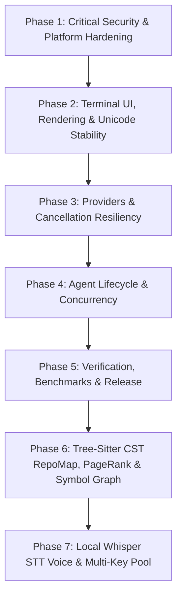
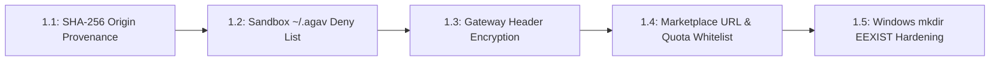
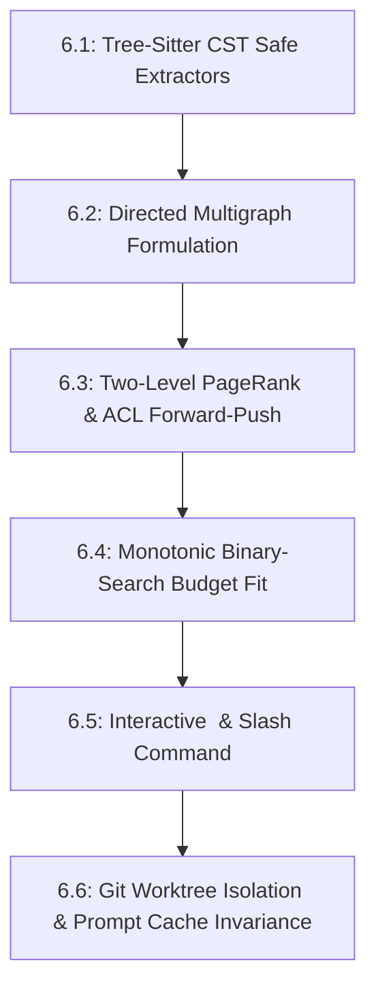
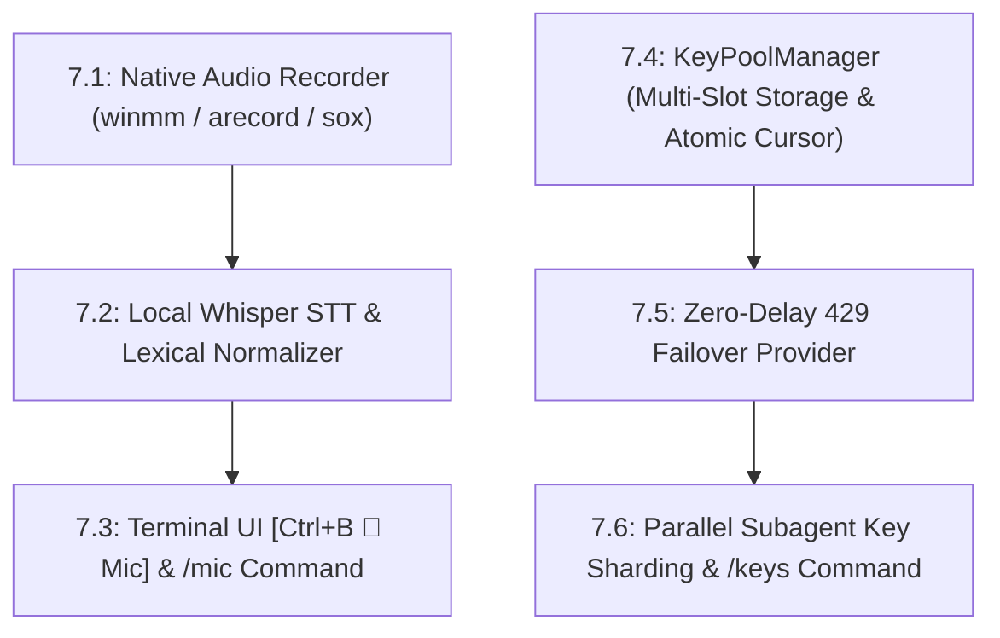

# Agav 7-Phase Development, Security, Code Intelligence & Voice Roadmap

> **Comprehensive platform hardening, security isolation, terminal UI stability, multi-provider resilience, Tree-Sitter CST symbol graph intelligence, local Whisper STT, and multi-key pooling.**

This document tracks the structured 7-phase engineering, security, and intelligence roadmap for **Agav**, derived from codebase security reviews, multi-platform runtime diagnostics, rigorous enterprise security audits, code-graph navigation requirements, local speech recognition, and high-throughput key pool architectures.

---

## Navigation & Related Documents

- [[Agav|Agav Platform Overview]]: Platform vision, CLI syntax, and core features.
- [[architecture|Agav Architecture Specification]]: Deep dive into the Agent Loop, custom Ink engine, RepoMap directed multigraph, voice engine, and key pool mesh.
- [[memory|Project Memory & Decisions Log]]: Architectural decisions, active trajectory, and bug resolution catalog.

---

## Roadmap Overview



    style P1 fill:#d73a49,color:#fff,stroke:#b31d28
    style P2 fill:#0366d6,color:#fff,stroke:#005cc5
    style P3 fill:#f66a0a,color:#fff,stroke:#d05005
    style P4 fill:#6f42c1,color:#fff,stroke:#5a32a3
    style P5 fill:#28a745,color:#fff,stroke:#22863a
    style P6 fill:#1f6feb,color:#fff,stroke:#388bfd
```

---

## Phase 1: Critical Security & Platform Hardening

**Goal:** Eliminate remote execution vectors, credential exfiltration paths, and cross-platform filesystem crashes.



### Tasks & Technical Specifications

#### Task 1.1: Auto-Update SHA-256 Checksum Provenance
- **Component:** `source/utils/auto-update.ts`
- **Issue:** Auto-update downloads binary assets from CDN mirrors (e.g. Cloudflare R2). If checksum manifests are also fetched from untrusted or compromised mirrors, an attacker could tamper with release binaries undetected.
- **Resolution:** Force SHA-256 signature verification to always retrieve `.sha256` digests directly from the official GitHub Release origin (`api.github.com/repos/prapaa-ai/agav/releases`), regardless of where the binary artifact payload is mirrored. Verify digest against the downloaded binary buffer before replacing `process.execPath`.

#### Task 1.2: Host Sandbox Credential Isolation
- **Component:** `source/agents/sandboxed-tool.ts`
- **Issue:** Untrusted marketplace or third-party service agents running inside OS sandboxes (Bubblewrap / Seatbelt) could access `~/.agav/` to read global API keys (`~/.agav/config.json`), agent credentials (`~/.agav/agents/*/config.json`), or session history.
- **Resolution:** Explicitly inject `getAgavDir()` (`~/.agav`) into the read-deny profile.
  - **Linux (`bwrap`):** Append `--tmpfs ~/.agav` or omit mount binds for the configuration directory.
  - **macOS (`sandbox-exec`):** Append `(deny file-read* (subpath "${getAgavDir()}"))` to the generated Seatbelt scheme.
  - **Docker:** Exclude `~/.agav` from mounted volumes.

#### Task 1.3: Gateway Credential Encryption
- **Component:** `source/config/config.ts`
- **Issue:** Custom gateway headers (`openaiHeaders`) used for enterprise proxies and custom routing contain bearer tokens and API secrets stored as plaintext JSON in user configuration files.
- **Resolution:** Encrypt `openaiHeaders` values at rest using Agav's AES-256-GCM encryption utility (`source/utils/encrypt.ts`). Transparently decrypt when instantiating the OpenAI / OpenRouter client.

#### Task 1.4: Agent Marketplace Fetch Hardening
- **Component:** `source/agents/installer.ts`
- **Issue:** Installing agents from unverified arbitrary URLs can trigger SSRF, local network traversal, or zip-bomb disk exhaustion.
- **Resolution:** Validate `baseUrl` against an allowed domain whitelist (`github.com`, `raw.githubusercontent.com`, `gitlab.com`). Enforce an upper bound HTTP response limit (e.g. 5 MB) on manifest and tool downloads.

#### Task 1.5: Windows Filesystem Hardening & Documentation Completion
- **Component:** `source/tools/file-write.ts`, `Agav.md`, `phases.md`, `memory.md`, `architecture.md`
- **Issue:** On Windows when using Bun or specific Node versions, calling `mkdir(dirname(filePath), { recursive: true })` throws an unhandled `EEXIST` error if the directory already exists or is current working directory (`.`).
- **Resolution:**
  - Wrap `mkdir` in `file-write.ts` with explicit `EEXIST` error handling (`(err as NodeJS.ErrnoException)?.code !== "EEXIST"`).
  - Complete the full Obsidian knowledge graph (`Agav.md`, `phases.md`, `memory.md`, `architecture.md`) with cross-references, architecture diagrams, and persistent decision logging.

---

## Phase 2: Terminal UI, Rendering & Unicode Stability

**Goal:** Deliver glitch-free rendering, accurate mouse selection, and robust Unicode handling across diverse terminal emulators.

### Tasks & Technical Specifications

#### Task 2.1: Chalk Colorizer Property Safety
- **Component:** `source/ink/colorize.ts`
- **Issue:** Passing non-color properties or unexpected style names to Chalk could invoke non-callable object properties (e.g. `level`, `bold`, `visible`), resulting in `TypeError: chalk[color] is not a function`.
- **Resolution:** Resolve foreground and background color keys dynamically, confirming that `typeof chalk[method] === "function"` before invocation. Fall back gracefully to unstyled text on unresolvable keys.

#### Task 2.2: Surrogate Pair & Grapheme Cluster Backspacing
- **Component:** `source/utils/session-picker.ts`
- **Issue:** Backspacing in search filters or session rename inputs sliced strings by UTF-16 code units (`slice(0, -1)`), splitting multi-byte emoji, composite graphemes, or ZWJ sequences into invalid replacement characters (`\uFFFD`).
- **Resolution:** Segment text using `Intl.Segmenter(undefined, { granularity: "grapheme" })` and drop the final segmented grapheme cluster.

#### Task 2.3: Multiline Input Caret & Prefix Alignment
- **Component:** `source/components/input-prompt.tsx`
- **Issue:** Multi-line user input prompts use a lock prefix (`❯ ` or `🔒 `) on line 1, but two-space indentation on subsequent rows. Using a uniform `prefixWidth` for click-to-offset calculation caused the caret to jump horizontally on continuation lines.
- **Resolution:** Pass target row metadata into `eventToOffset` to subtract the exact rendered prefix width (`isFirst ? prefixWidth : DEFAULT_PREFIX_WIDTH`). Synchronize wrap-table calculations to match.

#### Task 2.4: Render Clickable Occurrence Mapping
- **Component:** `source/utils/render-clickable.ts`
- **Issue:** When multiple overlapping file paths or URLs appeared in output (e.g. `/app` and `/app/build/index.js`), greedy substring matching misassigned click targets to the shorter prefix.
- **Resolution:** Map occurrences sequentially in source order with exclusive bounding ranges, ensuring longer specific targets receive priority.

#### Task 2.5: Markdown Nested List Indentation Preservation
- **Component:** `source/components/markdown-text.tsx`
- **Issue:** Hard-split source lines stripped leading whitespace during line wrapping, flattening nested bulleted lists and code block indentation.
- **Resolution:** Distinguish source-line starts from auto-wrapped continuation rows in `wrapStyled`, preserving leading spaces on original source lines.

#### Task 2.6: Text Mouse Event Forwarding
- **Component:** `source/ink/components/Text.tsx`
- **Issue:** `onMouseMove` events were omitted during props destructuring in `Text.tsx`, preventing mouse-drag selection over plain text elements.
- **Resolution:** Destructure `onMouseMove` alongside existing mouse handlers (`onMouseDown`, `onMouseUp`, `onClick`) and forward to `ink-text`.

---

## Phase 3: Providers & Cancellation Resiliency

**Goal:** Ensure instantaneous request cancellation, correct token accounting, and clock-skew resilience across all AI providers.

### Tasks & Technical Specifications

#### Task 3.1: Ollama Request Abort Signal Forwarding
- **Component:** `source/providers/ollama.ts`
- **Issue:** Caller cancellation via `AbortSignal` was only caught during stream iteration. If the local Ollama daemon was slow to start generation or queueing, the HTTP connection hung indefinitely.
- **Resolution:** Attach caller `signal` directly to `ollama.chat({ ..., signal })` with pre-flight abort check (`if (signal?.aborted) throw new AbortError()`).

#### Task 3.2: Vertex AI Service Account Clock Skew & JWT Expiration
- **Component:** `source/providers/vertex-ai.ts`
- **Issue:** Google OAuth 2.0 service account token minting failed with `invalid_grant` if local machine clocks drifted ahead of Google's time servers. Backdating `iat` without adjusting `exp` violated Google's maximum 3600-second assertion validity window.
- **Resolution:** Calculate `iat = Math.floor(Date.now() / 1000) - SKEW_SECONDS` and set `exp = iat + 3600`, maintaining an exact 1-hour window from the adjusted issued-at timestamp.

#### Task 3.3: OpenRouter Model ID Normalization & Headers
- **Component:** `source/providers/openrouter.ts`
- **Issue:** Model names with vendor prefixes or legacy identifiers caused 400 Bad Request responses when routed through OpenRouter gateways.
- **Resolution:** Standardize model IDs, inject `HTTP-Referer` and `X-Title` headers for open router attribution, and forward custom parameters cleanly.

#### Task 3.4: DeepSeek Provider & Dynamic Reasoning Token Extraction
- **Component:** `source/providers/deepseek.ts`, `source/providers/openai.ts`
- **Issue:** DeepSeek R1 outputs reasoning chains inside `<think>...</think>` tags or dedicated API reasoning fields rather than standard content blocks.
- **Resolution:** Dedicated provider adapter parsing reasoning deltas into `AgentEvent.thinking` events, enabling smooth terminal folding of reasoning processes.

---

## Phase 4: Agent Lifecycle & Concurrency

**Goal:** Bulletproof the lifecycle of service agents, polyglot A2A processes, and multi-agent coordination.

### Tasks & Technical Specifications

#### Task 4.1: Atomic Stage-Before-Delete Agent Installation
- **Component:** `source/agents/installer.ts`
- **Issue:** Updating or installing an agent directly wiped the target directory before download finished. Network interruptions left the agent in a broken, unusable state.
- **Resolution:** Clone/download and validate agent manifest and tools into a temporary staging folder (`tempDir`). Only upon successful validation, atomically move/rename staging directory to destination.

#### Task 4.2: TUI Agent Load Failure Recovery
- **Component:** `source/components/agents-tui.tsx`
- **Issue:** A corrupted `AGENT.md` or missing dependency in a single installed agent caused the entire `/agents` TUI screen to crash with an unhandled exception.
- **Resolution:** Wrap agent loader in error boundaries. Flag corrupted agents with an `[Error]` badge in the UI list, allowing the user to view diagnostics or uninstall them directly.

#### Task 4.3: Slash Command Namespace Reservation
- **Component:** `source/commands/registry.ts`
- **Issue:** Installing an agent with alias `model` or `resume` shadowed built-in interactive commands.
- **Resolution:** Enforce a reserved command name blacklist. Disallow agents whose aliases collide with core commands (`/resume`, `/branch`, `/model`, `/clear`, `/exit`, `/agents`, `/steer`, `/memory`).

#### Task 4.4: A2A Polyglot Subagent Process Supervision
- **Component:** `source/agents/sandboxed-tool.ts`
- **Issue:** Background A2A processes (Python, Rust, Go) occasionally orphaned after Agav session exit or timed out during loopback health probes.
- **Resolution:** Implement strict PID tracking with process-group signaling. Send `SIGTERM` followed by a 2-second `SIGKILL` deadline on shutdown. Enforce 127.0.0.1 loopback restrictions on endpoints.

---

## Phase 5: Verification, Benchmarks & Release

**Goal:** Establish rigorous automated regression suites, terminal benchmarks, and cross-platform native binaries.

### Tasks & Technical Specifications

#### Task 5.1: Cross-Platform Vitest Matrix
- Comprehensive test automation covering:
  - CLI boot & flag parsing (`source/__tests__/smoke.test.ts`).
  - Unit tests for all tools, config serialization, memory storage, and providers.
  - Windows, macOS, and Linux runner matrix in GitHub Actions.

#### Task 5.2: Terminal Performance Benchmarks
- Benchmark agent execution against `benchmarks/agav-agent/`:
  - Token-to-screen rendering latency (< 16ms per frame).
  - Memory consumption bounds with long conversation branches (< 150 MB RSS).
  - Process startup time (< 80ms compiled binary).

#### Task 5.3: Single-Binary Distribution & Mirror Automation
- Native standalone binary compilation with Bun:
  - `agav-linux-x64`, `agav-linux-arm64`
  - `agav-darwin-x64`, `agav-darwin-arm64`
  - `agav-windows-x64.exe`, `agav-windows-arm64.exe`
- Automated deployment to GitHub Releases and Cloudflare R2 mirror with SHA-256 integrity verification.

---

## Phase 6: Tree-Sitter CST RepoMap, Personalized PageRank & Directed Symbol Graph Engine

**Goal:** Provide dense, code-aware structural context within strict token budgets, ranking codebase landmarks using Personalized PageRank ($\alpha=0.85$), Andersen-Chung-Lang Forward-Push local approximation, and zero-flicker terminal UI navigation while preserving LLM prompt cache invariance.



### Tasks & Technical Specifications

#### Task 6.1: Multi-Language Safe AST & CST Extractors
- **Components:** `source/repomap/parser/safe-parser.ts`, `source/repomap/parser/extractors/typescript.ts`, `python.ts`, `rust.ts`, `go.ts`, `fallback.ts`
- **Capabilities:**
  - High-performance symbol extraction across TypeScript/JavaScript, Python, Rust, and Go with regex-based fallback for unstructured or non-CST files.
  - Safe extraction resilient to syntax errors, partial ASTs, and non-UTF-8 source buffers without throwing or aborting the parser process.
  - Normalizes symbol nodes (`function`, `class`, `interface`, `trait`, `struct`, `type`, `enum`, `variable`) with accurate line numbers, exported status, signatures, docstrings, and cross-file import/call references.

#### Task 6.2: Dual-Level Directed Multigraph Formulation
- **Component:** `source/repomap/graph/symbol-graph.ts`
- **Mathematical Model:** Directed multigraph $G = (V, E)$ partitioned into file nodes $V_F$ and symbol nodes $V_S$:
  - $V = V_F \cup V_S$
  - Edges $E$ capture structural relationships: `defines` ($f \to s$), `imports` ($f_1 \to f_2$), `calls` ($s_1 \to s_2$), `extends` ($s_1 \to s_2$), and `references` ($s \to s'$).
  - Coarse projection builds a file-to-file adjacency matrix $A_{F \times F}$ aggregating cross-file dependencies for macro-level flow computation.

#### Task 6.3: Two-Level Hierarchical PageRank & Andersen-Chung-Lang Forward-Push
- **Component:** `source/repomap/graph/pagerank.ts`
- **Algorithms:**
  - **Global Ranking (Power Iteration):** Standard power iteration on the coarse file graph with damping factor $\alpha=0.85$, uniform personalization $v_i = 1 / |F|$, and dangling node mass redistribution.
  - **Symbol-Level Score Cascade:** File scores cascade downward to symbol definitions based on incoming reference weights and exported visibility:
    $$p(s) = p(f) \cdot \left(0.7 \cdot \frac{w_{\text{in}}(s)}{\sum w_{\text{in}} + 10^{-6}} + 0.3 \cdot \frac{1}{|S_f|}\right) \cdot (s.\text{exported} ? 1.25 : 1.0)$$
  - **Seed-Personalized PageRank (Andersen-Chung-Lang Forward-Push):** For targeted contexts (e.g. active editing buffers, user file arguments), ACL local push maintains PageRank vector $p$ and residual vector $r$. Pops vertices with $r(u) \ge \epsilon$, converting $(1 - \alpha) r(u)$ into permanent score and pushing $\alpha r(u)$ across outgoing edges in $O(1/\epsilon)$ operations without computing global matrix products.

#### Task 6.4: Monotonic Binary-Search Budget Fitting Engine
- **Component:** `source/repomap/budget/binary-search-fit.ts`
- **Algorithm:**
  - Formulates token allocation as a monotonic threshold search over normalized PageRank scores.
  - Performs bisection between $\text{low} = 0.0$ and $\text{high} = 1.0$ to identify the maximal subset of high-ranking files and symbols that strictly fit within the target token budget (e.g. 1,500 tokens).
  - Employs deterministic grouping and ordering: files sorted by descending file PageRank, symbols grouped under parent files and ordered by source line number.

#### Task 6.5: Interactive `<RepoMapView>` Component & Slash Command Integration
- **Components:** `source/components/repo-map-view.tsx`, `source/commands/repomap.ts`, `source/tools/overview.ts`, `source/utils/system-prompt.ts`
- **Features:**
  - Slash command `/repomap` supporting optional flags: `--budget <tokens>`, `--focus <file>`, and `--json`.
  - Interactive Ink terminal UI component `<RepoMapView>` with live budget scaling (`+`/`-` by 200 tokens), search filtering (`/`), file tree expansion (`Enter`/`Space`), and color-coded symbol kind badges.
  - Dynamic system prompt and overview tool integration: automatically injects a compact, high-centrality codebase summary into LLM context, keeping agents oriented across complex repositories without manual file exploration.

#### Task 6.6: Git Worktree Isolation & Prompt Cache Invariance
- **Components:** `source/utils/worktree.ts`, `source/repomap/engine.ts`
- **Guarantees:**
  - Caches file ASTs with modification-time (`mtime`) and size invalidation, enabling sub-10ms graph re-evaluations on incremental file edits.
  - Strict worktree isolation ensures parallel branches or agent subtrees operate within their respective git worktrees without cache collision.
  - Stable token layout preserves prompt cache invariance across Anthropic Claude, Google Gemini, and OpenAI prompt caching layers.

---

## Phase 7: Native Local Whisper STT Voice Input, Multi-API-Key Pool & Adaptive Rate-Limit Sharding Engine

**Goal:** Integrate a 100% native local Speech-to-Text (STT) voice input pipeline and high-throughput multi-API-key pooling engine with transparent 429 failover and subagent key sharding, delivering zero-latency local voice interactions and linear multi-agent parallel execution speedup.



### Tasks & Technical Specifications

#### Task 7.1: Native Audio Recording & Controller Lifecycle
- **Components:** `source/voice/recorder.ts`, `source/voice/controller.ts`, `source/voice/types.ts`
- **Capabilities:**
  - Zero-install audio recording on Windows and standard system utility capture on Linux and macOS:
    - **Windows:** Native Windows Multimedia API (`winmm.dll` `mciSendString`) via interactive PowerShell child process recording 16kHz 16-bit mono WAV (zero external installation required).
    - **Linux:** Standard audio utilities (`arecord` via ALSA, or `sox`).
    - **macOS:** Command-line audio capture utilities (`sox` or `rec`).
  - `VoiceInputController` singleton lifecycle: start, stop, cancel, auto-stop timer (`maxDurationMs`), and reactive state listener subscriptions (`idle`, `recording`, `transcribing`, `error`).

#### Task 7.2: 100% Local Whisper STT Engine & Acoustic Tuning
- **Components:** `source/voice/whisper-local.ts`, `source/voice/lexicon.ts`, `source/voice/stt.ts`
- **Acoustic Adjustments & Algorithmic Parameters:**
  - **Dynamic Model & Binary Discovery:** Automatically resolves local whisper binaries and GGML model files from environment variables (`AGAV_WHISPER_BIN`, `AGAV_WHISPER_MODEL`), user configurations (`~/.agav/config.json`), local app paths, or system PATH.
  - **Minimum Silence Padding:** `MIN_DECODE_SAMPLES = 17600` (1.1s). Inspects WAV duration and zero-pads short speech clips to ensure maximum acoustic recognition accuracy.
  - **Dual Search Strategy:** Short utterances ($\le 8.0$s) decode using beam search (`-bs 2`) for high precision on technical and accented speech; longer audio ($>8.0$s) decodes with greedy search (`-bs 1 -bo 1`) to eliminate decode queue backlog.
  - **Context Window Truncation:** Clamps encoder frames via `-ac` to real audio duration plus 64 frames margin, reducing decode latency by ~30%.
  - **Physical Core Clamping:** Threads clamped to $\max(1, \min(6, \lfloor\text{CPUs}/2\rfloor))$ to saturate physical compute without starving LLM generation.
  - **Non-Speech Token & Hallucination Suppression:** Suppresses non-speech tokens (`-sns`), disables temperature fallback (`-nf`), applies `-nth 0.6`, filters bracketed annotations (`isJunk`), and filters prompt regurgitation (`isHintEcho`).
  - **Technical Developer Lexical Normalization:** Corrects phonetically ambiguous speech to standard terms (`Redis`, `Kubernetes`, `Kafka`, `PostgreSQL`, `GraphQL`, `PyTorch`, `JWT`, `LRU`, `allkeys-lru`, `thundering herd`, `CI/CD`).

#### Task 7.3: Terminal UI Mic Controls, Keybinding & `/mic` Command
- **Components:** `source/components/input-prompt.tsx`, `source/config/keybindings.ts`, `source/commands/mic.ts`
- **Features:**
  - Global `Ctrl+B` hotkey (`toggleVoiceInput`) bound in `DEFAULT_KEYBINDINGS` (with `Ctrl+M` supported on Kitty-protocol terminals; `Ctrl+M` is added to `ENHANCED_ONLY_STROKES` to prevent carriage-return terminal swallowing on standard consoles).
  - Mouse click toggle support: clicking the `[Ctrl+B 🎤 Mic]` badge or recording indicator toggles recording directly via mouse.
  - Non-intrusive interactive prompt UI: displays `[Ctrl+B 🎤 Mic]` badge alongside placeholder when idle (zero extra terminal rows, preserving mouse hit-testing and scrollback height), pulsating red dot banner when recording (`● [Recording... Press Ctrl+B or Enter to finish]`), and `⏳ [Transcribing speech locally...]` when transcribing.
  - Active text selections are smoothly replaced by transcribed speech upon completion.
  - Pressing `Enter` during recording automatically stops recording and transcribes without prematurely submitting.
  - Slash command `/mic` supporting `start`, `stop`, `status`, `config`, and toggle.

#### Task 7.4: Multi-API-Key Pool & Health Cooldown Manager
- **Components:** `source/providers/key-pool.ts`, `source/config/config.ts`
- **Features:**
  - Multi-key storage supporting comma-separated env vars (`ANTHROPIC_API_KEY="k1,k2"`), numbered env vars (`ANTHROPIC_API_KEY_1`, `_2`), and encrypted array fields in `config.json` via AES-256-GCM.
  - `KeyPoolManager` tracking slot state: `index`, `coolingUntil`, `activeRequests`, `totalRequests`, and `errorCount`.
  - Atomic round-robin cursor rotating through healthy keys. When rate limits occur, marks key in cooldown (`coolingUntil = now + retryAfterMs`) without exposing plaintext secrets.

#### Task 7.5: Zero-Delay 429 Failover Provider Wrapper
- **Component:** `source/providers/key-pool-provider.ts`
- **Features:**
  - Detects HTTP 429, quota exhaustion, and rate limit errors during stream initialization and early chunks.
  - Failover retries occur when the stream fails before emitting assistant content chunks. When alternative healthy keys exist in the pool, rotates immediately to the next key with zero sleep delay.
  - If rate limit occurs mid-stream after emitting content, the key is cooled down and the failure is propagated to avoid restart token duplication.
  - Backs off only if all registered keys in the pool are cooling down.

#### Task 7.6: Parallel Subagent Key Sharding & `/keys` Command
- **Components:** `source/tools/subagent.ts`, `source/commands/keys.ts`
- **Features:**
  - Deterministic key slot partitioning across concurrent subagents (`MAX_CONCURRENT = 5`): Subagent $i$ executes on Key slot $i \pmod K$, achieving linear parallel speedup without key contention.
  - Slash command `/keys [provider]`: Inspects registered key slots, health status, remaining cooldown time, active requests, total requests, and error counts with cryptographic key masking (e.g. `sk-ant...1234`).

---

## Phase 8: Interactive Onboarding Key Setup Wizard, First-Class Groq Provider & Dynamic Key Management

**Goal:** Eliminate startup friction, eliminate the need to type `$env:KEY` or edit JSON files, provide an interactive terminal credential setup wizard, integrate Groq as a high-speed inference provider with automatic multi-key pooling and failover, and support dynamic key additions/removals inside live sessions.

### Tasks & Technical Specifications

#### Task 8.1: Interactive Terminal Key Setup Wizard
- **Component:** `source/config/key-wizard.ts`
- **Capabilities:**
  - Invoked automatically when Agav launches without credentials for the chosen provider.
  - Interactive options:
    1. Enter single or multiple comma-separated keys for active provider.
    2. Switch provider (Google Gemini, Groq, OpenRouter, NVIDIA, DeepSeek, OpenAI, Anthropic, Ollama).
    3. Switch to local Ollama (100% offline, zero keys needed).
    4. Exit cleanly.
  - Automatically encrypts all keys at rest with AES-256-GCM in `~/.agav/config.json`.

#### Task 8.2: Startup Interception
- **Component:** `source/main.tsx`
- **Enhancement:** Replaces legacy crash on missing credentials (`providerConfigurationError -> process.exit(1)`) with `runInteractiveKeySetup()`. When configured, Agav proceeds immediately into the interactive session without requiring a terminal restart or manual environment exports.

#### Task 8.3: First-Class Groq Provider & Ultra-Fast Routing
- **Components:** `source/config/startup.ts`, `source/providers/registry.ts`, `source/commands/model-routing.ts`
- **Capabilities:**
  - Added `"groq"` to `PROVIDERS` and `DEFAULT_MODELS` with default model `llama-3.3-70b-versatile`.
  - Integrated `OpenAIProvider` with `baseURL: "https://api.groq.com/openai/v1"` and mode `"chat"`, wrapped by `KeyPoolProvider`.
  - Configured `/fast` (`llama-3.1-8b-instant`, ~800 tok/s) and `/deep` (`llama-3.3-70b-versatile`, ~300 tok/s) model routing.

#### Task 8.4: Live Dynamic Key Commands
- **Component:** `source/commands/keys.ts`
- **Capabilities:**
  - `/keys add <provider> <key1,key2,...>`: parses, encrypts, and registers keys live into `KeyPoolManager` without restarting Agav.
  - `/keys clear <provider>`: clears provider keys from configuration and active pool.

---

## Tracking & Progress Summary

| Phase | Description | Status | Focus Areas |
| :--- | :--- | :--- | :--- |
| **Phase 1** | Critical Security & Platform Hardening | **COMPLETED** | Checksums, Sandbox isolation, Windows `EEXIST`, Encrypted headers |
| **Phase 2** | Terminal UI & Unicode Stability | **COMPLETED** | Chalk safety, Graphemes, Multiline caret, Markdown indentation |
| **Phase 3** | Providers & Cancellation Resiliency | **COMPLETED** | Ollama abort signals, Vertex AI JWT skew, Model routing |
| **Phase 4** | Agent Lifecycle & Concurrency | **COMPLETED** | Atomic install, TUI error recovery, Command reservation, Spooling |
| **Phase 5** | Verification, Benchmarks & Release | **COMPLETED** | 110/110 test suites (940 passed), clean typecheck, native builds |
| **Phase 6** | Tree-Sitter CST RepoMap & PageRank Engine | **COMPLETED** | AST parsers, Directed multigraph, PPR ($\alpha=0.85$), ACL Forward-Push, Binary-search fit, `<RepoMapView>` TUI (117 suites, 998 passed, 0 CodeRabbit findings) |
| **Phase 7** | Local Whisper STT Voice & Multi-Key Pool | **COMPLETED** | Native `winmm` audio, 100% local Whisper STT with 1.1s pad & beam-2, `[Ctrl+B 🎤 Mic]`, mouse click toggle, `/mic`, `KeyPoolManager` zero-delay 429 failover, subagent key sharding, `/keys` (124 suites, 1102 passed, 100% green) |
| **Phase 8** | Interactive Key Setup Wizard & Groq Multi-Key | **COMPLETED** | Terminal onboarding setup wizard, AES-256-GCM multi-key storage, Groq provider with Llama 3.3 70B, `/keys add` and `/keys clear` dynamic management (125 suites, 1123 passed, 100% green) |

> [!TIP]
> Use `/remember` to log changes and project decisions as phases are implemented. For architecture details, refer to [[architecture|Agav Architecture Specification]].


